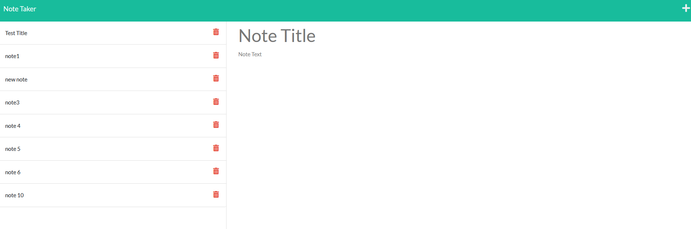

# Power Notes

  []

<!-- TABLE OF CONTENTS -->

  
Table of Contents

  <ol>
    <li>
      <a href="#about-the-project">About The Project</a>
      <ul>
        <li><a href="#built-with">Built With</a></li>
      </ul>
    </li>
    <li><a href="#usage">Usage</a></li>
    <li><a href="#contributing">Contributing</a></li>
    <li><a href="#license">License</a></li>
    <li><a href="#contact">Contact</a></li>
    <li><a href="#acknowledgments">Acknowledgments</a></li>
  </ol>

 
 

<!-- DESCRIPTION -->
## DESCRIPTION

<!--  -->

This is an application to enter and save notes to keep track of things you need to do.

This application was built primarily utilizing the following programming languages:

* CSS
* HTML
* Javascript
  - Node.js
  - Express.js

### Installation

N/A

<!-- USAGE EXAMPLES -->
## Usage

To use this application go to the webpage at https://power-notes.herokuapp.com/. You will be greated by the main page. Click on get started and you will see any saved notes  you have on the left. To enter a new note, enter a title in the title field, and the contntent of the note you want to save. Then click the save icon.

<!-- CONTRIBUTORING -->
## Contributing

N/A

<!-- LICENSE -->
## License

See https://opensource.org/licenses/MIT LICENSE for more information.

<!-- TEST -->
## TEST
N/A

<!-- Questions -->
## Questions?

Github Profile : <a href="https://github.com/matwll">matwll</a>
For questions [Email me @](mailto: maw01091989@gmail.com)
